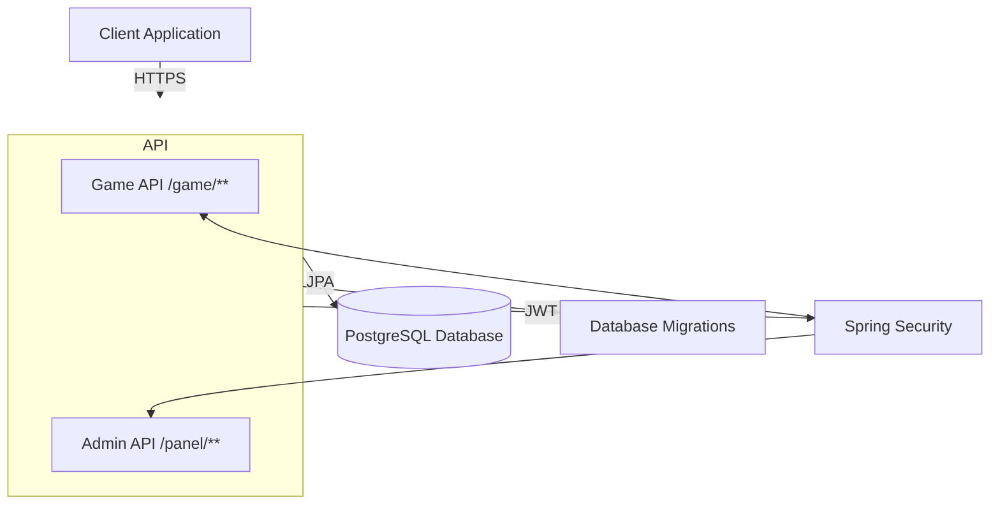
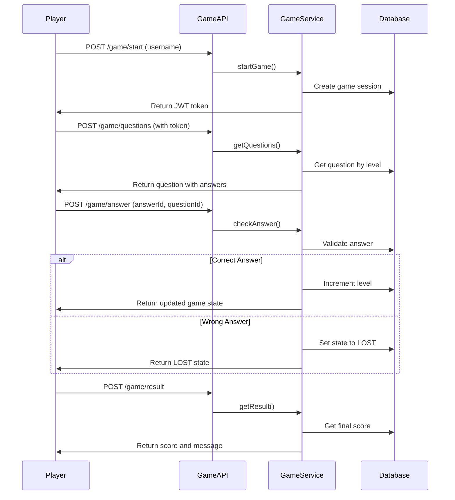

# Milyoner Application

A Spring Boot-based quiz game application similar to "Who Wants to Be a Millionaire". Players answer questions across 10 difficulty levels, with each correct answer advancing them to the next level. The application includes a comprehensive admin panel for managing questions and answers.

## Features

- **Game Play**: Start a game, answer questions across 10 levels, and track your progress
- **JWT Authentication**: Secure token-based authentication for both players and admins
- **Admin Panel**: Full CRUD operations for managing questions and answers
- **Question Management**: Create, update, delete, and query questions with multiple answers
- **Answer Management**: Create and manage answers for questions
- **Game State Management**: Track game progress with states (START_GAME, IN_PROGRESS, WON, LOST, QUIT)
- **Database Migrations**: Flyway-based database schema versioning
- **RESTful API**: Clean REST API design with standardized response format

## Tech Stack

- **Framework**: Spring Boot 3.5.8
- **Language**: Java 21
- **Database**: PostgreSQL (with Flyway migrations)
- **Security**: Spring Security with JWT (OAuth2 Resource Server)
- **Build Tool**: Maven
- **Validation**: Jakarta Validation
- **Utilities**: Lombok, Guava

## Architecture

The application follows a domain-driven design with clear separation of concerns:

```
milyoner-app/
├── common/              # Shared utilities and configurations
│   ├── security/       # JWT, authentication, security config
│   ├── error/          # Error definitions
│   └── exception/      # Custom exceptions
├── gameplay/           # Game logic and domain
│   ├── domain/         # Game domain models
│   ├── service/        # Game business logic
│   ├── data/           # Data persistence layer
│   └── web/            # Game API controllers and DTOs
└── question/           # Question management
    ├── domain/         # Question domain models
    ├── service/        # Question business logic
    ├── data/           # Data persistence layer
    └── web/            # Admin API controllers and DTOs
```

### System Architecture



### Game Flow



## Prerequisites

- Java 21 or higher
- Maven 3.6+
- PostgreSQL 12+ (or Docker for containerized setup)
- Docker and Docker Compose (optional, for database setup)

## Installation & Setup

### 1. Clone the Repository

```bash
git clone <repository-url>
cd milyoner-app
```

### 2. Database Setup

#### Option A: Using Docker Compose (Recommended)

```bash
docker-compose up -d
```

This will start a PostgreSQL container with:
- Database: `milyoner`
- Username: `postgres`
- Password: `postgres`
- Port: `5432`
- Schema: `game`

#### Option B: Manual PostgreSQL Setup

1. Create a PostgreSQL database named `milyoner`
2. Create a schema named `game`
3. Update `application.yml` with your database credentials

### 3. Configuration

The application configuration is in `src/main/resources/application.yml`:

```yaml
spring:
  datasource:
    url: jdbc:postgresql://localhost:5432/milyoner?currentSchema=game
    username: postgres
    password: postgres
    
jwt:
  secret: <your-secret-key>
  expiration: 3600000  # 1 hour in milliseconds
```

**Important**: Change the JWT secret key in production!

### 4. Build the Application

```bash
./mvnw clean install
```

Or on Windows:

```bash
mvnw.cmd clean install
```

### 5. Run the Application

```bash
./mvnw spring-boot:run
```

Or run the JAR file:

```bash
java -jar target/milyoner-0.0.1-SNAPSHOT.jar
```

The application will start on `http://localhost:8080` (default Spring Boot port).

## Database Schema

The application uses Flyway for database migrations. The schema includes:

### Tables

- **question**: Stores quiz questions
  - `id` (SERIAL PRIMARY KEY)
  - `question_text` (VARCHAR(255))
  - `question_level` (INT, 1-10)
  - `is_activate` (BOOLEAN)

- **answer**: Stores answers for questions
  - `id` (SERIAL PRIMARY KEY)
  - `answer_text` (VARCHAR(255))
  - `is_activate` (BOOLEAN)
  - `is_correct` (BOOLEAN)
  - `question_id` (INT, FK to question)

- **gamer**: Tracks game sessions
  - `id` (VARCHAR(255) PRIMARY KEY) - Game session ID
  - `username` (VARCHAR(50))
  - `game_id` (VARCHAR(255))
  - `question_level` (INT)
  - `game_state` (game_state_type ENUM)

- **admin**: Admin user accounts (created via migration V1.2.0)

### Game States

- `START_GAME`: Initial state when game is created
- `IN_PROGRESS`: Game is active and player is answering questions
- `WON`: Player successfully completed all 10 levels
- `LOST`: Player answered incorrectly
- `QUIT`: Player quit the game

## Security

The application uses two separate security filter chains:

### 1. Game Filter Chain (`/game/**`)
- Public endpoint: `/game/start`
- All other endpoints require JWT authentication
- Uses custom `GameJwtConverter` for game session tokens
- Tokens contain `gameId` claim for session tracking

### 2. Admin Filter Chain (`/panel/**`)
- Public endpoints: `/panel/auth/login`, `/panel/auth/user/register`, `/panel/auth/admin/register`
- Admin operations require `ADMIN` role
- Uses standard JWT authentication with role-based access control

### CORS Configuration

CORS is configured to allow requests from:
- `http://localhost:5173`
- `http://127.0.0.1:5173`

Update `SecurityConfig.java` to add additional origins if needed.

## Project Structure

```
src/main/java/org/maoco/milyoner/
├── common/                          # Shared components
│   ├── ApiResponse.java            # Standardized API response wrapper
│   ├── ControllerAdvice.java       # Global exception handler
│   ├── error/                      # Error code definitions
│   ├── exception/                  # Custom exceptions
│   └── security/                   # Security configuration
│       ├── SecurityConfig.java     # Security filter chains
│       ├── TokenService.java       # JWT token generation
│       ├── GameJwtConverter.java   # Custom JWT converter for games
│       └── GameSessionContext.java # Game session context
│
├── gameplay/                       # Game domain
│   ├── domain/                    # Domain models
│   │   ├── Game.java              # Game entity
│   │   ├── Question.java          # Question entity
│   │   ├── Answer.java            # Answer entity
│   │   └── UserScore.java         # User score entity
│   ├── service/                   # Business logic
│   │   ├── GameService.java       # Main game service
│   │   ├── GamePersistenceService.java # Data persistence
│   │   └── GameState.java         # Game state enum
│   ├── data/                      # Data layer
│   │   ├── entity/               # JPA entities
│   │   └── repository/           # Spring Data repositories
│   └── web/                      # Web layer
│       ├── controller/           # REST controllers
│       └── dto/                  # Data transfer objects
│
└── question/                      # Question management domain
    ├── domain/                   # Domain models
    ├── service/                  # Business logic
    ├── data/                     # Data layer
    └── web/                      # Web layer
        ├── controller/           # REST controllers
        └── dto/                 # Data transfer objects
```

## Development

### Running Tests

```bash
./mvnw test
```

### Database Migrations

Database migrations are located in `src/main/resources/db/migration/`:

- `V1.0.0__init_schema.sql` - Initial schema creation
- `V1.0.1__init_data.sql` - Initial data seeding
- `V1.1.0__alter_gamer_table.sql` - Gamer table alterations
- `V1.2.0__create_admin_table.sql` - Admin table creation

Flyway automatically runs migrations on application startup.

### API Documentation

See [API.md](API.md) for complete API documentation including:
- All endpoints
- Request/response formats
- Authentication details
- Error codes

## Game Rules

1. Players start at level 1 and progress through 10 levels
2. Each question has 4 answers (1 correct, 3 incorrect)
3. Answering correctly advances to the next level
4. Answering incorrectly ends the game (LOST state)
5. Completing all 10 levels results in a win (WON state)
6. Each question must have at least 4 active answers (1 correct + 3 incorrect)

## License

[Specify your license here]

## Contributing

[Add contribution guidelines if applicable]
